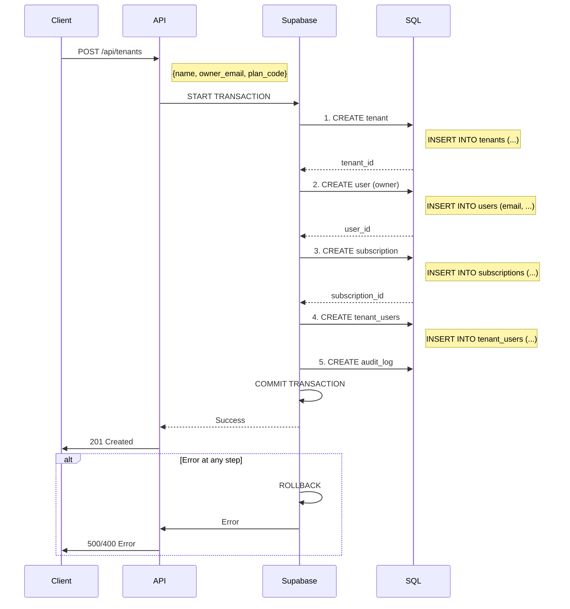

# Guide Professionnel de l'Intégrité Multilocataire

> **Auteur**: Mistral Vibe  
> **Date**: 12 juin 2026  
> **Version**: 1.0  
> **Statut**: Production Ready

---

## 📋 Table des Matières

1. [Introduction et Contexte](#-introduction-et-contexte)
2. [Architecture Multilocataire Recommandée](#-architecture-multilocataire-recommandée)
3. [Séquence Atomique de Création](#-séquence-atomique-de-création)
4. [Schéma de Base de Données Professionnel](#-schéma-de-base-de-données-professionnel)
5. [Flux de Travail Robuste](#-flux-de-travail-robuste)
6. [Déclencheurs et Intégrité](#-déclencheurs-et-intégrité)
7. [Middleware et Validation](#-middleware-et-validation)
8. [Synchronisation Bidirectionnelle](#-synchronisation-bidirectionnelle)
9. [Récupération des Données](#-récupération-des-données)
10. [Bonnes Pratiques Opérationnelles](#-bonnes-pratiques-operationnelles)
11. [Annexes](#-annexes)

---

## 🎯 Introduction et Contexte

### Problème Initial
Votre application souffrait de problèmes majeurs d'intégrité des données après une réinitialisation complète des bases SQLite et Supabase :
- ✗ La création de locataire ne garantissait pas la création automatique des utilisateurs associés
- ✗ La table `tenant_users` restait vide malgré la présence de données utilisateurs
- ✗ Aucune vérification des dépendances entre les tables
- ✗ Pas de gestion atomique des transactions

### Objectifs
- ✅ **Atomicité**: Toutes les opérations liés à un tenant doivent réussir ou échouer ensemble
- ✅ **Cohérence**: Les données doivent rester cohérentes entre SQLite et Supabase
- ✅ **Isolation**: Chaque tenant doit être isolé des autres
- ✅ **Durabilité**: Les données doivent survivre aux pannes
- ✅ **Auto-réparation**: Détection et correction automatique des incohérences

---

## 🏗️ Architecture Multilocataire Recommandée

### Modèle de Données Core

```
┌─────────────────┐
│     tenants     │◄─────────────────────────┐
├─────────────────┤                         │
│ id (PK)         │                         │
│ slug (UQ)       │                         │
│ name            │                         │
│ owner_email     │                         │
│ status          │                         │
│ is_provisioned  │                         │
│ created_at      │                         │
│ updated_at      │                         │
└─────────────────┘                         │
                                                  │
┌─────────────────┐        ┌─────────────────────┐
│     users       │        │   tenant_users      │
├─────────────────┤        ├─────────────────────┤
│ id (PK)         │        │ id (PK)             │
│ email (UQ)      │        │ tenant_id (FK)     │◄────┘
│ full_name       │        │ user_id (FK)       │◄──┐
│ username (UQ)   │        │ role               │   │
│ password_hash   │        │ is_default          │   │
│ pin_code        │        │ is_active           │   │
│ role            │        │ joined_at           │   │
│ is_active       │        │ created_at          │   │
│ tenant_id (FK)  │◄───────┘ updated_at          │   │
│ has_setup_pin   │                                  │
│ created_at      │──────────────────────────────┘
│ updated_at      │
└─────────────────┘
```

### Niveaux de Priorité de Synchronisation

| Niveau | Tables | Dépendances | Description |
|--------|--------|-------------|-------------|
| 0 | plans, tenants | Aucune | Tables de base |
| 1 | users | tenants | Utilisateurs |
| 2 | tenant_users, subscriptions | tenants, users, plans | Relations critiques |
| 3 | categories, products, restaurant_tables | tenants | Données métiers |
| 4 | orders, sales, inventory | tenants, users, products | Données transactionnelles |
| 5 | notifications, logs | tenants, users | Données secondaires |

---

## 🔄 Séquence Atomique de Création

### Flux de Création d'un Nouveau Tenant



### Implémentation TypeScript

```typescript
// saas-supabase.repository.ts
async create(
  dto: CreateTenantDto, 
  plan: Plan, 
  _subscription: Subscription, 
  ownerUserId?: number
): Promise<Tenant> {
  const supabase = db();
  
  // 1. Validation
  if (!dto.name || !dto.owner_email || !plan) {
    throw new SaaSError('Missing required fields', 400, 'VALIDATION_ERROR');
  }
  
  let tenant: any = null;
  let subscription: any = null;
  let createdOwnerUserId = ownerUserId;
  let ownerCreated = false;
  
  try {
    const now = new Date();
    
    // 2. Create tenant
    const { data: tenantData, error: tErr } = await supabase
      .from('tenants').insert({ /* tenant data */ })
      .select().single();
    
    if (tErr) throw tErr;
    tenant = tenantData;
    
    // 3. Create or update owner user
    if (!createdOwnerUserId) {
      // Check if user exists
      const { data: existingUser } = await supabase
        .from('users').select('id').eq('email', dto.owner_email).maybeSingle();
      
      if (existingUser) {
        createdOwnerUserId = existingUser.id;
        await supabase.from('users').update({ tenant_id: tenant.id })
          .eq('id', createdOwnerUserId);
      } else {
        // Create new owner
        const { data: newOwner, error: uErr } = await supabase
          .from('users').insert({ /* owner data */ })
          .select().single();
        
        if (uErr) {
          await supabase.from('tenants').delete().eq('id', tenant.id);
          throw uErr;
        }
        createdOwnerUserId = newOwner.id;
        ownerCreated = true;
      }
    }
    
    // 4. Create subscription
    const { data: subData, error: sErr } = await supabase
      .from('subscriptions').insert({ /* subscription data */ })
      .select().single();
    
    if (sErr) {
      await supabase.from('tenants').delete().eq('id', tenant.id);
      if (ownerCreated) await supabase.from('users').delete().eq('id', createdOwnerUserId);
      throw sErr;
    }
    subscription = subData;
    
    // 5. Create tenant_users relationship (CRITICAL)
    const { error: tuErr } = await supabase
      .from('tenant_users').insert({
        tenant_id: tenant.id,
        user_id: createdOwnerUserId,
        role: 'owner',
        is_default: true,
        is_active: true,
        joined_at: now.toISOString()
      });
    
    if (tuErr) {
      // Rollback
      await supabase.from('subscriptions').delete().eq('id', subscription.id);
      await supabase.from('tenants').delete().eq('id', tenant.id);
      if (ownerCreated) await supabase.from('users').delete().eq('id', createdOwnerUserId);
      throw tuErr;
    }
    
    // 6. Log audit
    await this.logAction(tenant.id, 'tenant.created', 'tenant', tenant.id, createdOwnerUserId, {
      plan_code: plan.code,
      subscription_id: subscription.id
    });
    
    return this.fromRow(tenant);
    
  } catch (error: any) {
    // Centralized error handling with cleanup
    if (tenant?.id) {
      await supabase.from('tenant_users').delete().eq('tenant_id', tenant.id);
      await supabase.from('subscriptions').delete().eq('tenant_id', tenant.id);
      await supabase.from('tenants').delete().eq('id', tenant.id);
    }
    if (ownerCreated && createdOwnerUserId) {
      await supabase.from('users').delete().eq('id', createdOwnerUserId);
    }
    throw error;
  }
}
```

---

## 🗄️ Schéma de Base de Données Professionnel

### PostgreSQL/Supabase (Tables Principales)

```sql
-- Table: tenants
CREATE TABLE tenants (
    id BIGSERIAL PRIMARY KEY,
    slug VARCHAR(64) UNIQUE NOT NULL,
    name VARCHAR(255) NOT NULL,
    owner_email VARCHAR(255) UNIQUE NOT NULL,
    owner_phone VARCHAR(20),
    country VARCHAR(2) DEFAULT 'ZM',
    timezone VARCHAR(50) DEFAULT 'Africa/Lusaka',
    status VARCHAR(20) DEFAULT 'active' CHECK (status IN ('active','suspended','cancelled','trial')),
    is_provisioned BOOLEAN DEFAULT false,
    provisioned_at TIMESTAMPTZ,
    created_at TIMESTAMPTZ DEFAULT NOW(),
    updated_at TIMESTAMPTZ DEFAULT NOW()
);

-- Table: users
CREATE TABLE users (
    id BIGSERIAL PRIMARY KEY,
    email VARCHAR(255) UNIQUE NOT NULL,
    full_name VARCHAR(255),
    username VARCHAR(64) UNIQUE,
    password_hash TEXT,
    pin_code TEXT,
    role VARCHAR(20) DEFAULT 'staff' CHECK (role IN ('owner','admin','manager','cashier','waiter','staff')),
    is_active BOOLEAN DEFAULT true,
    has_setup_pin BOOLEAN DEFAULT false,
    tenant_id BIGINT REFERENCES tenants(id) ON DELETE CASCADE,
    remote_id BIGINT,
    created_at TIMESTAMPTZ DEFAULT NOW(),
    updated_at TIMESTAMPTZ DEFAULT NOW()
);

-- Table: tenant_users (LIAISON CRITIQUE)
CREATE TABLE tenant_users (
    id BIGSERIAL PRIMARY KEY,
    tenant_id BIGINT NOT NULL REFERENCES tenants(id) ON DELETE CASCADE,
    user_id BIGINT NOT NULL REFERENCES users(id) ON DELETE CASCADE,
    role VARCHAR(20) NOT NULL DEFAULT 'staff' CHECK (role IN ('owner','admin','manager','cashier','waiter','staff')),
    is_default BOOLEAN DEFAULT false,
    is_active BOOLEAN DEFAULT true,
    joined_at TIMESTAMPTZ,
    invited_at TIMESTAMPTZ,
    remote_id BIGINT,
    UNIQUE(tenant_id, user_id),
    created_at TIMESTAMPTZ DEFAULT NOW(),
    updated_at TIMESTAMPTZ DEFAULT NOW()
);

-- Index pour performances
CREATE INDEX idx_tenants_slug ON tenants(slug);
CREATE INDEX idx_users_email ON users(email);
CREATE INDEX idx_users_tenant ON users(tenant_id);
CREATE INDEX idx_tenant_users_tenant ON tenant_users(tenant_id);
CREATE INDEX idx_tenant_users_user ON tenant_users(user_id);
CREATE INDEX idx_tenant_users_remote ON tenant_users(remote_id) WHERE remote_id IS NOT NULL;
CREATE INDEX idx_tenant_users_tenant_user ON tenant_users(tenant_id, user_id);
```

### SQLite (Migration Idempotente)

Voir `backend/migrations/012_saas_multitenant_schema.sql`

---

## 🌊 Flux de Travail Robuste

### Initialisation d'un Nouveau Tenant (Production)

```typescript
// server.ts
async function initializeTenant(tenantData: CreateTenantDto) {
  const saasRepo = getSaaSRepository();
  
  try {
    // 1. Récupérer le plan
    const plan = await saasRepo.plans!.findByCode(tenantData.plan_code);
    if (!plan) throw new PlanNotFoundError(tenantData.plan_code);
    
    // 2. Créer l'abonnement placeholder
    const placeholderSub: any = {
      id: 0,
      tenant_id: 0,
      plan_id: plan.id,
      status: 'pending',
      started_at: new Date().toISOString(),
      current_period_start: new Date().toISOString(),
      current_period_end: new Date(Date.now() + plan.duration_days * 86400000).toISOString(),
      auto_renew: plan.period !== 'trial'
    };
    
    // 3. Créer le tenant avec toutes ses dépendances (ATOMIQUE)
    const tenant = await saasRepo.tenants!.create(
      tenantData,
      plan,
      placeholderSub
    );
    
    // 4. Initialiser le Sync Service pour ce tenant
    const syncService = getUserTenantSyncService();
    if (syncService) {
      await syncService.syncNow(tenant.id.toString());
    }
    
    // 5. Créer les données par défaut du tenant
    await initializeDefaultTenantData(tenant.id);
    
    // 6. Marquer comme provisionné
    await saasRepo.tenants!.markProvisioned(tenant.id);
    
    return tenant;
    
  } catch (error: any) {
    console.error('[Server] Tenant initialization failed:', error);
    throw error;
  }
}

async function initializeDefaultTenantData(tenantId: number) {
  // Créer les catégories par défaut
  // Créer les tables de restaurant par défaut
  // Créer les paramètres par défaut
  // etc.
}
```

### Escuela de Synchronisation

```typescript
// Flux complet de synchronisation
╔════════════════════════════════════════════════════════════════╗
║                  SYNC ORCHESTRATOR                                 ║
╠════════════════════════════════════════════════════════════════╣
║                                                                  ║
║  ┌─────────────┐    ┌─────────────┐    ┌───────────────┐     ║
║  │ Niveau 0    │    │ Niveau 1    │    │ Niveau 2      │     ║
║  │ tenants     │───▶│ users      │───▶│ tenant_users  │     ║
║  │ plans       │    │             │    │ subscriptions  │     ║
║  └─────────────┘    └─────────────┘    └───────────────┘     ║
║                                  │                              ║
║                                  ▼                              ║
║  ┌─────────────┐    ┌─────────────┐                          ║
║  │ Niveau 3    │    │ Niveau 4    │                          ║
║  │ categories  │───▶│ orders      │                          ║
║  │ products    │    │ sales       │                          ║
║  │ restaurant_ │    │ order_items │                          ║
║  │ tables      │    │ inventory   │                          ║
║  └─────────────┘    └─────────────┘                          ║
║                                  │                              ║
║                                  ▼                              ║
║                         ┌─────────────┐                         ║
║                         │ Niveau 5    │                         ║
║                         │ notifications │                         ║
║                         │ logs        │                         ║
║                         └─────────────┘                         ║
║                                                                  ║
╚════════════════════════════════════════════════════════════════╝

```

---

## 🔧 Déclencheurs et Intégrité

### Déclencheurs PostgreSQL (Triggers)

#### 1. Déclencleur de Mise à Jour de `updated_at`

```sql
-- Fonction de base pour la mise à jour automatique
CREATE OR REPLACE FUNCTION update_updated_at_column()
RETURNS TRIGGER AS $$
BEGIN
    NEW.updated_at = NOW();
    RETURN NEW;
END;
$$ LANGUAGE plpgsql;

-- Appliquer à toutes les tables principales
CREATE TRIGGER update_tenants_updated_at
    BEFORE UPDATE ON tenants
    FOR EACH ROW EXECUTE FUNCTION update_updated_at_column();

CREATE TRIGGER update_users_updated_at
    BEFORE UPDATE ON users
    FOR EACH ROW EXECUTE FUNCTION update_updated_at_column();

CREATE TRIGGER update_tenant_users_updated_at
    BEFORE UPDATE ON tenant_users
    FOR EACH ROW EXECUTE FUNCTION update_updated_at_column();
```

#### 2. Déclencleur de Vérification d'Intégrité

```sql
CREATE OR REPLACE FUNCTION check_tenant_user_integrity()
RETURNS TRIGGER AS $$
BEGIN
    -- Vérifier que le tenant existe
    IF NOT EXISTS (SELECT 1 FROM tenants WHERE id = NEW.tenant_id) THEN
        RAISE EXCEPTION 'Tenant % does not exist', NEW.tenant_id;
    END IF;
    
    -- Vérifier que l'utilisateur existe
    IF NOT EXISTS (SELECT 1 FROM users WHERE id = NEW.user_id) THEN
        RAISE EXCEPTION 'User % does not exist', NEW.user_id;
    END IF;
    
    -- Empêcher la suppression du dernier owner
    IF NEW.role = 'owner' THEN
        PERFORM 1 FROM tenant_users 
        WHERE tenant_id = NEW.tenant_id AND role = 'owner' AND id != NEW.id;
        
        IF NOT FOUND THEN
            RAISE EXCEPTION 'Cannot remove the last owner from tenant %', NEW.tenant_id;
        END IF;
    END IF;
    
    RETURN NEW;
END;
$$ LANGUAGE plpgsql;

CREATE TRIGGER trg_tenant_users_insert_update
    BEFORE INSERT OR UPDATE ON tenant_users
    FOR EACH ROW EXECUTE FUNCTION check_tenant_user_integrity();

-- Empêcher la suppression du dernier owner
CREATE OR REPLACE FUNCTION prevent_last_owner_deletion()
RETURNS TRIGGER AS $$
DECLARE
    remaining_owners INTEGER;
BEGIN
    SELECT COUNT(*) INTO remaining_owners
    FROM tenant_users 
    WHERE tenant_id = OLD.tenant_id AND role = 'owner' AND id != OLD.id;
    
    IF remaining_owners = 0 AND OLD.role = 'owner' THEN
        RAISE EXCEPTION 'Cannot delete the last owner of tenant %', OLD.tenant_id;
    END IF;
    
    RETURN OLD;
END;
$$ LANGUAGE plpgsql;

CREATE TRIGGER trg_tenant_users_delete
    BEFORE DELETE ON tenant_users
    FOR EACH ROW EXECUTE FUNCTION prevent_last_owner_deletion();
```

#### 3. Déclencleur de Synchronisation du `tenant_id`

```sql
-- Quand un user est mis à jour, synchroniser tenant_id dans tenant_users
CREATE OR REPLACE FUNCTION sync_user_tenant_id()
RETURNS TRIGGER AS $$
BEGIN
    IF NEW.tenant_id IS DISTINCT FROM OLD.tenant_id THEN
        -- Mettre à jour toutes les relations tenant_users
        UPDATE tenant_users 
        SET tenant_id = NEW.tenant_id
        WHERE user_id = NEW.id AND tenant_id != NEW.tenant_id;
    END IF;
    RETURN NEW;
END;
$$ LANGUAGE plpgsql;

CREATE TRIGGER trg_sync_user_tenant_id
    BEFORE UPDATE ON users
    FOR EACH ROW EXECUTE FUNCTION sync_user_tenant_id();
```

---

## 🛡️ Middleware et Validation

### Middleware de Validation du Contexte Tenant/User

```typescript
// src/server/middleware/tenant-validation.ts

import { Request, Response, NextFunction } from 'express';

/**
 * Middleware combiné: Vérifie tenant + user + relation
 * Utilisation: router.use(validateTenantUserContext(['owner', 'admin']))
 */
async function validateTenantUserContext(
  req: Request, 
  res: Response, 
  next: NextFunction,
  requiredRoles?: string[]
) {
  const tenantId = req.params.tenantId || req.body.tenantId;
  const userId = (req as any).user?.sub || (req as any).user?.id;
  
  if (!tenantId || !userId) {
    return res.status(400).json({ error: 'MISSING_PARAMS' });
  }
  
  try {
    const supabase = getSupabase();
    
    // Vérifier tenant
    const { data: tenant } = await supabase
      .from('tenants').select('status').eq('id', tenantId).maybeSingle();
    
    if (!tenant) return res.status(404).json({ error: 'TENANT_NOT_FOUND' });
    if (tenant.status !== 'active') return res.status(403).json({ error: 'TENANT_INACTIVE' });
    
    // Vérifier user
    const { data: user } = await supabase
      .from('users').select('is_active').eq('id', userId).maybeSingle();
    
    if (!user) return res.status(404).json({ error: 'USER_NOT_FOUND' });
    if (!user.is_active) return res.status(403).json({ error: 'USER_INACTIVE' });
    
    // Vérifier relation tenant_user
    const { data: tenantUser } = await supabase
      .from('tenant_users')
      .select('role, is_active')
      .eq('tenant_id', tenantId)
      .eq('user_id', userId)
      .maybeSingle();
    
    if (!tenantUser) return res.status(403).json({ error: 'ACCESS_DENIED' });
    if (!tenantUser.is_active) return res.status(403).json({ error: 'ACCESS_REVOKED' });
    
    // Vérifier permissions
    if (requiredRoles && !requiredRoles.includes(tenantUser.role)) {
      return res.status(403).json({ error: 'INSUFFICIENT_PERMISSIONS' });
    }
    
    // Tout est valide
    (req as any).tenantContext = {
      tenantId: Number(tenantId),
      userId: Number(userId),
      role: tenantUser.role
    };
    next();
    
  } catch (err: any) {
    console.error('[Middleware] Validation failed:', err);
    return res.status(500).json({ error: 'VALIDATION_ERROR' });
  }
}
```

### Utilisation dans Express

```typescript
// Exemple: Route protégée par tenant
router.get('/api/tenants/:tenantId/reports',
  validateTenantUserContext.bind(null, null, null, ['owner', 'admin']),
  async (req, res) => {
    const { tenantId, userId, role } = (req as any).tenantContext;
    const reports = await generateReports(tenantId);
    res.json(reports);
  }
);
```

---

## 🔄 Synchronisation Bidirectionnelle

### Service de Synchronisation Amélioré

#### Fonctionnalités Clés du `SyncOrchestrator`

```typescript
// Capabilities:
- Synchronisation atomique dans l'ordre des dépendances
- Détection automatique des incohérences
- Réparation automatique des relations manquantes
- Gestion des dépendances entre tables
- Suivi des curseurs persistants
- Queue de messages (Outbox Pattern)
- Dead Letter Queue pour les erreurs
```

#### Ordre de Synchronisation

```typescript
// SYNC_PRIORITY_ORDER
[
  // Niveau 0: Base
  { name: 'plans', priority: 0, dependencies: [] },
  { name: 'tenants', priority: 0, dependencies: [] },
  
  // Niveau 1: Utilisateurs
  { name: 'users', priority: 1, dependencies: ['tenants'] },
  
  // Niveau 2: Relations
  { name: 'tenant_users', priority: 2, dependencies: ['tenants', 'users'] },
  { name: 'subscriptions', priority: 2, dependencies: ['tenants', 'plans'] },
  
  // Niveau 3-5: Données métiers
  // ...
]
```

#### Détection des Incohérences

```typescript
// Dans user-tenant-sync.service.ts
private async ensureDataIntegrity(tenantId: string): Promise<{ fixed: number }> {
  let fixed = 0;
  
  // 1. Vérifier que chaque user a un tenant_user
  const usersWithoutTenantUser = this.db.prepare(`
    SELECT id FROM users 
    WHERE tenant_id = ? 
    AND NOT EXISTS (SELECT 1 FROM tenant_users 
                    WHERE user_id = users.id AND tenant_id = ?)
  `).all(tenantId, tenantId) as { id: number }[];
  
  for (const user of usersWithoutTenantUser) {
    this.db.prepare(`
      INSERT INTO tenant_users (...)
      VALUES (?, ?, 'staff', false, true, ?)
    `).run(tenantId, user.id, new Date().toISOString());
    fixed++;
  }
  
  // 2. Vérifier qu'il y a un owner
  const owners = this.db.prepare(`
    SELECT id FROM tenant_users 
    WHERE tenant_id = ? AND role = 'owner' AND is_active = true
  `).all(tenantId) as { id: number }[];
  
  if (owners.length === 0) {
    // Promouvoir le premier user en owner
    const firstUser = this.db.prepare(`
      SELECT id FROM users WHERE tenant_id = ? ORDER BY created_at ASC LIMIT 1
    `).get(tenantId) as { id: number };
    
    if (firstUser) {
      this.db.prepare(`
        INSERT INTO tenant_users (...)
        VALUES (?, ?, 'owner', true, true, ?)
        ON CONFLICT (tenant_id, user_id) 
        DO UPDATE SET role = 'owner', is_default = true
      `).run(tenantId, firstUser.id, new Date().toISOString());
      fixed++;
    }
  }
  
  return { fixed };
}
```

---

## 🗑️ Récupération des Données

### Script de Récupération d'Urgence

**Fichier**: `SUPABASE_RECOVERY_SCRIPT.sql`

#### Que fait ce script ?

1. **Étape 1**: Vérifie et crée les colonnes manquantes
2. **Étape 2**: Crée les contraintes et index
3. **Étape 3**: Répare les incohérences principales
   - Crée les utilisateurs manquants pour les owners
   - Crée les relations tenant_users manquantes
   - Assure la cohérence des tenant_id
4. **Étape 4**: Nettoie les données orphelines
5. **Étape 5**: Vérification et rapport
6. **Étape 6**: Crée les déclencheurs d'intégrité
7. **Étape 7**: Configure RLS (Row Level Security)

#### Instructions d'utilisation

```bash
# 1. Connectez-vous à Supabase SQL Editor
# 2. Copiez-collez le contenu de SUPABASE_RECOVERY_SCRIPT.sql
# 3. Exécutez le script
# 4. Vérifiez le rapport final

-- Vérifier les problèmes persistants
SELECT * FROM tenant_integrity_report WHERE status != '✅ OK';

-- Nettoyer la vue temporaire après vérification
DROP VIEW IF EXISTS tenant_integrity_report;
```

#### Résultat Attendu

```
tenant_id | tenant_name | user_count | tenant_user_count | owner_count | default_count | status
----------|-------------|------------|-------------------|-------------|---------------|--------
1         | Mon Tenant  | 3          | 3                 | 1           | 1             | ✅ OK
2         | Autre       | 2          | 2                 | 1           | 1             | ✅ OK
```

### Réparation Programme (TypeScript)

```typescript
// highlight-start
// Utilisation du service de réparation
const orchestrator = getSyncOrchestrator();

async function repairAllTenants() {
  const { data: tenants } = await getSupabase()
    .from('tenants')
    .select('id')
    .order('created_at', { ascending: true });
  
  for (const tenant of tenants || []) {
    console.log(`Réparation du tenant ${tenant.id}...`);
    
    const result = await orchestrator.repairTenant(tenant.id.toString());
    
    if (result.issuesFound.length > 0) {
      console.warn(`  ⚠️  Problèmes trouvés: ${result.issuesFound.join(', ')}`);
    }
    if (result.issuesFixed > 0) {
      console.log(`  ✅ ${result.issuesFixed} problèmes réparés`);
    }
    if (result.errors > 0) {
      console.error(`  ❌ ${result.errors} erreurs`);
    }
  }
}
// highlight-end
```

---

## 📐 Bonnes Pratiques Opérationnelles

### 1. Configuration Supabase

#### Politiques RLS Recommandées

```sql
-- Désactiver RLS par défaut (le service_role le contourne)
ALTER TABLE tenants DISABLE ROW LEVEL SECURITY;
ALTER TABLE users DISABLE ROW LEVEL SECURITY;
ALTER TABLE tenant_users DISABLE ROW LEVEL SECURITY;

-- Ou configurer des politiques adaptées
CREATE POLICY "Service role full access"
    ON all_tables FOR ALL
    USING (auth.jwt() ->> 'role' = 'service_role');

CREATE POLICY "Users can view their tenant"
    ON tenants FOR SELECT
    USING (EXISTS (
        SELECT 1 FROM tenant_users tu
        WHERE tu.tenant_id = tenants.id 
        AND tu.user_id = (auth.jwt() ->> 'sub')::BIGINT
    ));
```

#### Configuration des Index

```sql
-- Index essentiels pour les performances
CREATE INDEX idx_tenants_slug ON tenants(slug);
CREATE INDEX idx_tenants_status ON tenants(status);
CREATE INDEX idx_tenants_owner_email ON tenants(owner_email);

CREATE INDEX idx_users_email ON users(email);
CREATE INDEX idx_users_tenant ON users(tenant_id);
CREATE INDEX idx_users_username ON users(username);

CREATE INDEX idx_tenant_users_tenant ON tenant_users(tenant_id);
CREATE INDEX idx_tenant_users_user ON tenant_users(user_id);
CREATE INDEX idx_tenant_users_tenant_user ON tenant_users(tenant_id, user_id);
CREATE INDEX idx_tenant_users_role ON tenant_users(role);
```

### 2. Stratégie de Backup

#### Sauvegardes Supabase

```bash
# Sauvegarde complète quotidienne
pg_dump -Fc -d db_url -f backup_$(date +%Y%m%d).dump

# Sauvegarde des données uniquement (plus léger)
pg_dump -Fc -d db_url --data-only -f data_$(date +%Y%m%d).dump
```

#### Monitoring

```typescript
// Monitoring de l'intégrité
setInterval(async () => {
  const tenants = await getAllTenants();
  
  for (const tenant of tenants) {
    const integrity = await checkTenantIntegrity(tenant.id);
    
    if (integrity.issues.length > 0) {
      // Envoyer alerte
      await sendAlert({
        type: 'DATA_INTEGRITY_ISSUE',
        severity: 'HIGH',
        tenantId: tenant.id,
        tenantName: tenant.name,
        issues: integrity.issues,
        timestamp: new Date().toISOString()
      });
    }
  }
}, 3600000); // Toutes les heures
```

### 3. Tests de Résilience

#### Tests Unitaires Essentiels

```typescript
// tests/tenant-integrity.test.ts
import { SupabaseTenantRepository } from '../src/server/saas/repositories/supabase/saas-supabase.repository';

describe('Tenant Integrity', () => {
  let repo: SupabaseTenantRepository;
  
  beforeAll(() => {
    repo = new SupabaseTenantRepository();
  });
  
  test('should create tenant with all dependencies', async () => {
    const plan = { id: 1, code: 'trial_7d', period: 'trial', duration_days: 7 };
    const dto = {
      name: 'Test Tenant',
      owner_email: 'test@example.com',
      plan_code: 'trial_7d'
    };
    
    const tenant = await repo.create(dto, plan, {} as any);
    
    const integrity = await repo.checkTenantIntegrity(tenant.id);
    
    expect(integrity.hasOwner).toBe(true);
    expect(integrity.hasDefaultUser).toBe(true);
    expect(integrity.userCount).toBeGreaterThan(0);
    expect(integrity.issues).toHaveLength(0);
  });
  
  test('should repair missing dependencies', async () => {
    // Créer un tenant sans owner dans tenant_users
    const { data: tenant } = await supabase
      .from('tenants').insert({ name: 'Broken Tenant', owner_email: 'broken@example.com' })
      .select().single();
    
    await supabase.from('users').insert({
      email: 'broken@example.com',
      full_name: 'Broken User',
      tenant_id: tenant.id
    });
    
    // Réparer
    const result = await repo.repairTenantIntegrity(tenant.id);
    
    expect(result.fixed).toBe(true);
    
    const integrity = await repo.checkTenantIntegrity(tenant.id);
    expect(integrity.hasOwner).toBe(true);
  });
});
```

### 4. Checklist de Déploiement

- [ ] Exécuter `SUPABASE_RECOVERY_SCRIPT.sql` sur l'instance Supabase
- [ ] Vérifier que tous les tenants ont un `owner` dans `tenant_users`
- [ ] Configurer les déclencheurs PostgreSQL
- [ ] Configurer RLS (Row Level Security) si nécessaire
- [ ] Créer des index sur les colonnes fréquemment interrogées
- [ ] Configurer les sauvegardes automatiques
- [ ] Mettre en place le monitoring
- [ ] Tester les cas de panne (simuler des erreurs de réseau)
- [ ] Vérifier les/timeouts de synchronisation
- [ ] Configurer les alertes pour les problèmes d'intégrité

---

## 📚 Annexes

### A. Glossaire

| Terme | Définition |
|-------|------------|
| Tenant | Entité logique représentant un client/locataire |
| Tenant User | Relation entre un tenant et un utilisateur avec un rôle |
| Multitenancy | Architecture où plusieurs tenants partagent les mêmes ressources |
| Atomicité | Propriété d'une transaction à être entièrement exécutée ou pas du tout |
| Cohérence | Propriété garantissant que les données restent valides |
| Isolation | Propriété garantissant que les transactions sont indépendantes |
| Durabilité | Propriété garantissant que les données survivent aux pannes |

### B. Codes d'Erreur

| Code | Description | Action Recommandée |
|------|-------------|-------------------|
| `TENANT_CREATE_FAILED` | Échec de création du tenant | Vérifier les contraintes unique |
| `OWNER_CREATE_FAILED` | Échec de création de l'owner | Vérifier l'email unique |
| `SUBSCRIPTION_CREATE_FAILED` | Échec de création de l'abonnement | Vérifier le plan_id |
| `TENANT_USER_CREATE_FAILED` | Échec de création de la relation | Vérifier les IDs |
| `TENANT_NOT_FOUND` | Tenant introuvable | Vérifier l'ID |
| `VALIDATION_ERROR` | Erreur de validation | Vérifier les champs requis |

### C. Références

- [Supabase Documentation](https://supabase.com/docs)
- [PostgreSQL Triggers](https://www.postgresql.org/docs/current/sql-createtrigger.html)
- [RLS in Supabase](https://supabase.com/docs/guides/auth/row-level-security)
- [GRASP Composite Pattern](https://en.wikipedia.org/wiki/GRASP_(object-oriented_design))
- [Transaction Projects Pattern](https://martinfowler.com/eaaCatalog/transactionScript.html)

### D. Contacts

**Auteur**: Mistral Vibe  
**Email**: stevenkabwee@gmail.com  
**Dates**: Juin 2026

---

© 2026 Mistral Vibe - Tous droits réservés

*Ce document est un guide technique destiné aux développeurs professionnels. Les implémentations peuvent varier selon les besoins spécifiques du projet.*
